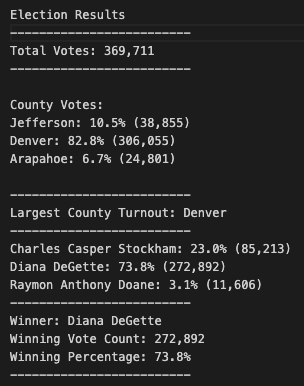

# Election_Analysis

---

## Project Overview 

This election audit aims to assist the Colorado Board of Elections in determining the results of the election for the US Congressional precinct in Colorado. This paper will use python to help automate the process, which is usually done in excel. A vote count report will be generated in order to certify the election results. 

### Aim

The main aim of this paper was to collect the following information:

1) Total number of votes cast 

2) A complete list of candidates who received votes

3) Total number of votes each candidate received 

4) Percentage of votes each candidate won 

5) The winner of the election based on popular vote

6) The voter turnout for each county

7) The percentage of votes from each county out of the total count

8) The county with the highest turnout

--- 

# Resources

- Data Sources: election_results.csv

- Software: Python 3.10.1

---
## Summary 

The analysis of the election showed: 

#### - Total number of votes cast

```Python
# Read the csv and convert it into a list of dictionaries
with open(file_to_load) as election_data:
    reader = csv.reader(election_data)

    # Read the header
    header = next(reader)

    # For each row in the CSV file.
    for row in reader:

        # Add to the total vote count
        total_votes = total_votes + 1
```

There were 369,711 votes cast in the election. 

#### - The candidates who received votes and provide number of votes
  
```Python  
# Get the candidate name from each row.
        candidate_name = row[2]

        # 3: Extract the county name from each row.
        county_name = row[1]

        # If the candidate does not match any existing candidate add it to
        # the candidate list
        if candidate_name not in candidate_options:

            # Add the candidate name to the candidate list.
            candidate_options.append(candidate_name)

            # And begin tracking that candidate's voter count.
            candidate_votes[candidate_name] = 0

        # Add a vote to that candidate's count
        candidate_votes[candidate_name] += 1
  ```
    
Candidates and vote counts:
 - Charles Casper Stockham recieved 85,213 votes
 - Diana DeGette recieved 272,892 votes
 - Anthony Doane recieved 11,606 votes

#### - The total percentage of votes each candidate won

```Python
# Retrieve vote count and percentage
        votes = candidate_votes.get(candidate_name)
        vote_percentage = float(votes) / float(total_votes) * 100
        candidate_results = (
            f"{candidate_name}: {vote_percentage:.1f}% ({votes:,})\n")
```

Candidate vote percentage:
- Charles Casper Stockham recieved 23.0% of the votes
- Diana DeGette recieved 73.8% of the votes
- Anthony Doane recieved 3.1% of the votes

#### - The winner of the election based on popular vote

```Python
# Determine winning vote count, winning percentage, and candidate.
        if (votes > winning_count):
            winning_count = votes
            winning_candidate = candidate_name
            winning_percentage = vote_percentage
```

It can be determined that the winner of the election based on popular vote was **Diana Gette**, who received 73.8% of the votes with 272,892 votes

#### - County turnout vote count & percentage
```Python
# 6a: Write a for loop to get the county from the county dictionary.
    for county_name in county_votes:
        # 6b: Retrieve the county vote count.
        county = county_votes.get(county_name)
        # 6ci: Calculate the percentage of votes for the county.
        county_percentage = float(county) / float(total_votes) * 100
        #6cii: Create County Results 
        county_results = (
            f"{county_name}: {county_percentage:.1f}% ({county:,})\n")
```

The voter turnout for each county was
- Jefferson produced 10.5% of voters, with 38,855 votes
- Denver produced 82.8% of voters, with 306,055 votes
- Arapahoe produced 6.7% of voters, with 24,801 votes


#### - County with largest voter turnout
```Python
# 6f: Write an if statement to determine the winning county and get its vote count.
        if (county > winning_county_count):
            winning_county_count = county
            winning_county = county_name
```
The county with the largest voter turnout was Denver, which produced 82.8% of voters, for a total of 306,055 votes.

<p align="center">

</p>
